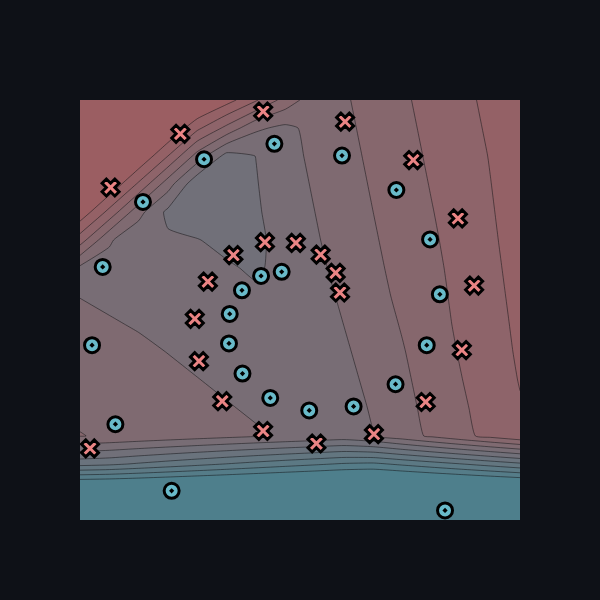
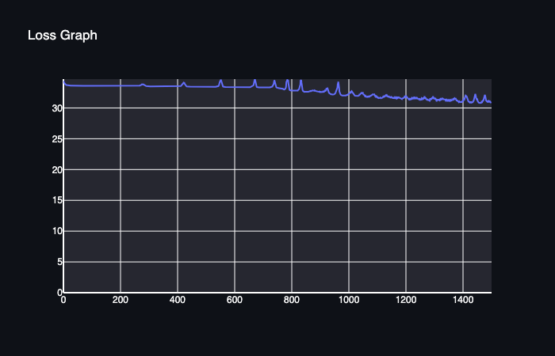

[](https://classroom.github.com/a/YFgwt0yY)
# MiniTorch Module 2


* Docs: https://minitorch.github.io/

* Overview: https://minitorch.github.io/module2/module2/

This assignment requires the following files from the previous assignments. You can get these by running

```bash
python sync_previous_module.py previous-module-dir current-module-dir
```

The files that will be synced are:

        minitorch/operators.py minitorch/module.py minitorch/autodiff.py minitorch/scalar.py minitorch/scalar_functions.py minitorch/module.py project/run_manual.py project/run_scalar.py project/datasets.py

## Training Summary

### Simple

Hyperparameters:
- Hidden: 2
- Rate: 0.5
- Epochs: 250
- Data points: 50
- Time per epoch: 0.049 seconds


### Diagonal
- Hidden: 2
- Rate: 0.5
- Epochs: 250
- Data points: 50
- Time per epoch: 0.050 seconds


### Split

Hyperparameters:
- Hidden: 5
- Rate: 0.1
- Epochs: 750
- Data points: 50
- Time per epoch: 0.133 seconds


### XOR

Hyperparameters:
- Hidden: 8
- Rate: 0.1
- Epochs: 600
- Data points: 50
- Time per epoch: 0.252 seconds


### Circle

Hyperparameters:
- Hidden: 12
- Rate: 0.1
- Epochs: 1000
- Data points: 50
- Time per epoch: 0.566 seconds


### Spiral

Ran out of time :/

Hyperparameters:
- Hidden: 10
- Rate: 0.1
- Epochs: 1500
- Data points: 50
- Time per epoch: 0.356 seconds






### Simple

| Epoch | Loss | Correct |
|-------|------|---------|
0/250|0|0
10/250|32.71043229460034|34
20/250|30.813734698847412|34
30/250|29.322968885999845|36
40/250|24.646328873728184|44
50/250|18.33208032106895|49
60/250|12.739554945893639|50
70/250|8.835778623541577|50
80/250|6.532962216763532|50
90/250|5.098689191818016|50
100/250|4.164623025431765|50
110/250|3.527485905766498|50
120/250|3.0564912431781193|50
130/250|2.701431154353467|50
140/250|2.4178093939052623|50
150/250|2.183398066955472|50
160/250|1.9867685714932253|50
170/250|1.819741568256543|50
180/250|1.676311883749771|50
190/250|1.5519743132951167|50
200/250|1.4432852086021069|50
210/250|1.3475690474199558|50
220/250|1.2651760513978307|50
230/250|1.190262775971802|50
240/250|1.1256819015911355|50
250/250|1.067504641903449|50

### Diagonal

| Epoch | Loss | Correct |
|-------|------|---------|
0/250|0|0
10/250|20.681922362811605|42
20/250|17.814650165790518|42
30/250|15.252180582018724|42
40/250|12.620564773376113|42
50/250|10.028075102738011|42
60/250|7.782588164307309|47
70/250|6.076421154297423|49
80/250|5.199994625621353|49
90/250|4.6528070403081605|49
100/250|4.216861191900035|49
110/250|3.847639572758458|49
120/250|3.531402815923513|49
130/250|3.2684385115453214|49
140/250|3.0351358764443033|49
150/250|2.840475307352606|49
160/250|2.6649331778127716|49
170/250|2.5055980726699985|50
180/250|2.360233082450035|50
190/250|2.227049835841716|50
200/250|2.104594179890384|50
210/250|1.991665046065008|50
220/250|1.887256129608998|50
230/250|1.790513355809761|50
240/250|1.700703396511527|50
250/250|1.6171900366042542|50

### Split


| Epoch | Loss | Correct |
|-------|------|---------|
0/750|0|0
10/750|34.252523856494825|26
20/750|33.90648204572877|26
30/750|33.786635205729645|26
40/750|33.68074923098339|27
50/750|33.57586435201942|38
60/750|33.46984011941561|38
70/750|33.35707878676851|39
80/750|33.23461000972403|35
90/750|33.12362692777782|30
100/750|33.01643114190465|29
110/750|32.91062570723954|29
120/750|32.79993010992486|29
130/750|32.683475765314945|30
140/750|32.560387101871676|30
150/750|32.429428446138466|31
160/750|32.29008483053135|31
170/750|32.14153080876902|31
180/750|31.982891110093895|31
190/750|31.81302418683472|31
200/750|31.63047736658606|31
210/750|31.433950715424444|31
220/750|31.22217188008832|31
230/750|30.993881840649607|31
240/750|30.74783054419042|34
250/750|30.482781660742447|37
260/750|30.20498528149905|37
270/750|29.91513798554311|38
280/750|29.611596252972003|38
290/750|29.290465010259098|38
300/750|28.949127810265555|38
310/750|28.586890693345477|38
320/750|28.201325756884373|41
330/750|27.790115405454497|42
340/750|27.353543839570122|44
350/750|26.895483020233872|44
360/750|26.413763191314608|44
370/750|25.905400027814323|45
380/750|25.366014903888505|45
390/750|24.794856469151103|46
400/750|24.186614670026024|45
410/750|23.533782235999375|46
420/750|22.83755560730381|48
430/750|22.080236758511116|48
440/750|21.272550177177717|48
450/750|20.456819784726015|48
460/750|19.621658723859294|48
470/750|18.821115822290974|48
480/750|18.064289063427715|48
490/750|17.339164497757423|49
500/750|16.626679261344854|49
510/750|15.918847290111707|49
520/750|15.227263322829948|49
530/750|14.56356903980158|49
540/750|13.93178844527162|49
550/750|13.326540691550923|49
560/750|12.761952972216761|49
570/750|12.234841839594443|49
580/750|11.737265723526875|49
590/750|11.265392947125498|49
600/750|10.818286740266814|49
610/750|10.394995084373434|49
620/750|9.994540897843855|49
630/750|9.617206109722384|49
640/750|9.267151262433773|49
650/750|8.936691092684491|49
660/750|8.623862096249985|49
670/750|8.328086552813678|49
680/750|8.048464857759402|49
690/750|7.784468469948231|49
700/750|7.536775348958355|49
710/750|7.3022477247187885|49
720/750|7.080134795468314|49
730/750|6.869772992170692|49
740/750|6.671465346652232|49
750/750|6.48342368945057|49


### XOR


| Epoch | Loss | Correct |
|-------|------|---------|
0/600|0|0
10/600|35.72268970715541|23
20/600|34.22149023246021|25
30/600|33.73576075820077|33
40/600|33.41661930013062|32
50/600|33.122154445483105|33
60/600|32.8011611568033|32
70/600|32.521151773105316|32
80/600|32.197047878384225|33
90/600|31.837196723761732|34
100/600|31.44917592411942|34
110/600|31.01123803343496|34
120/600|30.539631211237275|35
130/600|30.007964063259063|37
140/600|29.4394692039135|38
150/600|28.838834974983524|39
160/600|28.25819919218955|39
170/600|27.65634434944655|39
180/600|27.025809112057015|39
190/600|26.372313031932713|40
200/600|25.697645257436122|44
210/600|24.99933931979115|45
220/600|24.286249488486963|46
230/600|23.561386458356985|46
240/600|22.822317723746426|46
250/600|22.066707654282883|46
260/600|21.2975049031391|46
270/600|20.516626862087712|47
280/600|19.714852151470925|47
290/600|18.91783926303974|48
300/600|18.137595362130227|47
310/600|17.367897938859606|48
320/600|16.601086241486144|48
330/600|15.871024306011826|48
340/600|15.172969902664889|48
350/600|14.500477800377535|48
360/600|13.864544732629621|48
370/600|13.25679838756341|49
380/600|12.669970857212686|49
390/600|12.108956419260272|49
400/600|11.573222051726644|49
410/600|11.064158939343212|49
420/600|10.574521465935309|49
430/600|10.109524860955439|49
440/600|9.668699724143476|49
450/600|9.253502814684358|49
460/600|8.85696588169289|49
470/600|8.489911937182345|49
480/600|8.118167444304385|49
490/600|7.7922354671688785|49
500/600|7.486523393271766|50
510/600|7.197680576024964|50
520/600|6.924603354284343|50
530/600|6.666039196785217|50
540/600|6.422501518235133|50
550/600|6.194265822136|50
560/600|5.979661533447096|50
570/600|5.775427402518799|50
580/600|5.583956197193701|50
590/600|5.400496999850083|50
600/600|5.2322054391893476|50

### Circle

| Epoch | Loss | Correct |
|-------|------|---------|
0/1000|0|0
10/1000|33.715818600732604|26
20/1000|33.330564173984044|28
30/1000|33.03694940391086|29
40/1000|32.745498184843015|30
50/1000|32.44357858517769|30
60/1000|32.12688470752596|31
70/1000|31.783207295142304|32
80/1000|31.409265877783387|33
90/1000|31.012733956472786|34
100/1000|30.581215893715562|35
110/1000|30.11929562465746|36
120/1000|29.624735600526268|36
130/1000|29.087418053541423|37
140/1000|28.493476277987376|38
150/1000|27.860900039512778|40
160/1000|27.16444077915044|39
170/1000|26.417438078404057|42
180/1000|25.64037514182325|42
190/1000|24.834364756568537|42
200/1000|24.025286355750936|43
210/1000|23.19410609787814|45
220/1000|22.34478094396901|45
230/1000|21.496971394080703|45
240/1000|20.662547923278666|47
250/1000|19.843899177412244|47
260/1000|19.049987205589723|46
270/1000|18.29250490479358|45
280/1000|17.57660829338433|45
290/1000|16.903812306746723|45
300/1000|16.276889125061793|45
310/1000|15.69652674203304|45
320/1000|15.164202810031366|45
330/1000|14.673439118866233|45
340/1000|14.219373937192458|45
350/1000|13.799688497477986|45
360/1000|13.410429333212035|46
370/1000|13.050511124436879|46
380/1000|12.721383520998344|46
390/1000|12.316700204607333|46
400/1000|11.972273022716317|46
410/1000|11.655918048640011|46
420/1000|11.353861374141001|46
430/1000|11.064049813741919|46
440/1000|10.787655860973196|46
450/1000|10.521132451471432|46
460/1000|10.27883798541172|46
470/1000|10.057376108113274|46
480/1000|9.84768191482724|46
490/1000|9.644336513045777|46
500/1000|9.448886963893047|47
510/1000|9.260961448346931|47
520/1000|9.07696832382609|47
530/1000|8.90144283683514|47
540/1000|8.729889731573248|47
550/1000|8.566099729062056|47
560/1000|8.406025769319793|47
570/1000|8.25306025576013|47
580/1000|8.104767417982591|47
590/1000|7.961512640074671|47
600/1000|7.822234087834383|47
610/1000|7.687264889803591|47
620/1000|7.556178416600223|47
630/1000|7.428660222028895|47
640/1000|7.304623659032219|47
650/1000|7.183890119296207|47
660/1000|7.066495569121495|47
670/1000|6.945146943318841|47
680/1000|6.845904429149422|47
690/1000|6.73011530417301|47
700/1000|6.628458087612251|47
710/1000|6.5346265017868985|47
720/1000|6.42606979717426|48
730/1000|6.308386937648613|48
740/1000|6.1912164880445815|48
750/1000|6.082868984523654|48
760/1000|5.9844065868478|48
770/1000|5.87553280951758|48
780/1000|5.781210081054274|49
790/1000|5.679254357175916|49
800/1000|5.577991680109063|49
810/1000|5.487372073071238|49
820/1000|5.394688598209709|49
830/1000|5.304489107931241|49
840/1000|5.2257973291546715|49
850/1000|5.143013181928425|49
860/1000|5.053542416782189|49
870/1000|4.9749984906417515|49
880/1000|4.899657988857021|49
890/1000|4.825599549892717|49
900/1000|4.753722421992859|49
910/1000|4.682445664661545|49
920/1000|4.6153149563237585|49
930/1000|4.547141828232018|49
940/1000|4.48300220681366|49
950/1000|4.418319047742995|49
960/1000|4.3561894295431856|49
970/1000|4.295872175983696|49
980/1000|4.235896873162018|49
990/1000|4.177650709318789|49
1000/1000|4.120556919057877|49

### Spiral

| Epoch | Loss | Correct |
|-------|------|---------|
0/1500|0|0
10/1500|33.74554890063432|27
20/1500|33.66699857974959|27
30/1500|33.622833068028214|28
40/1500|33.60795776841381|27
50/1500|33.60060825709314|27
60/1500|33.59458108950208|27
70/1500|33.590659782261085|27
80/1500|33.58689144613026|27
90/1500|33.58350580053019|27
100/1500|33.58033902142541|27
110/1500|33.57778984082856|27
120/1500|33.574690507760444|27
130/1500|33.57146530394252|27
140/1500|33.56877851890376|27
150/1500|33.56646900897816|27
160/1500|33.56358842800629|27
170/1500|33.56089635848912|27
180/1500|33.55808496546898|27
190/1500|33.55485228104937|28
200/1500|33.55124853953419|28
210/1500|33.547327990798344|28
220/1500|33.543342234653835|28
230/1500|33.53938566423838|28
240/1500|33.53641410031143|28
250/1500|33.538466228671076|28
260/1500|33.550388635390355|29
270/1500|33.677204786911034|30
280/1500|33.89386778581857|28
290/1500|33.56852455170268|29
300/1500|33.5145415925596|29
310/1500|33.50486640002025|29
320/1500|33.4991535189815|28
330/1500|33.4941727890341|28
340/1500|33.48996595626803|28
350/1500|33.4867364237883|29
360/1500|33.48422710231226|29
370/1500|33.48452053333349|29
380/1500|33.48106444523607|29
390/1500|33.479126163452676|29
400/1500|33.487148563083|29
410/1500|33.51534249309929|30
420/1500|34.05712053637223|26
430/1500|33.58374641637297|29
440/1500|33.46032684605372|29
450/1500|33.45036916970345|29
460/1500|33.44410977667587|29
470/1500|33.43795666616325|29
480/1500|33.432126249778236|29
490/1500|33.425840571408195|29
500/1500|33.42009811243003|29
510/1500|33.417853386851185|29
520/1500|33.414986773283005|27
530/1500|33.429071365932685|28
540/1500|33.49567299188488|29
550/1500|34.339750229388954|28
560/1500|33.49089786263827|29
570/1500|33.39236381704733|29
580/1500|33.38337526201686|29
590/1500|33.37571678536521|29
600/1500|33.36786465791082|29
610/1500|33.36417269727912|29
620/1500|33.35317100530958|29
630/1500|33.34602623571815|29
640/1500|33.3395092487547|29
650/1500|33.34843801733675|31
660/1500|33.46220318730732|29
670/1500|34.57524106837321|27
680/1500|33.374556531008174|29
690/1500|33.31200151934946|29
700/1500|33.28349783192715|31
710/1500|33.26826607498292|31
720/1500|33.29000850104846|29
730/1500|33.40848766906535|28
740/1500|34.50258623996586|26
750/1500|33.26279675944956|30
760/1500|33.19134486954664|30
770/1500|33.11350332796498|28
780/1500|33.26432263155304|27
790/1500|33.50581367494603|29
800/1500|32.81947741785652|30
810/1500|32.756907814581375|29
820/1500|32.800265418085566|28
830/1500|33.70508797714854|31
840/1500|32.76171519625314|28
850/1500|32.6104416187189|31
860/1500|32.65207468236585|27
870/1500|32.79379474379791|25
880/1500|32.811906966090156|25
890/1500|32.69412997813651|25
900/1500|32.57333627178389|26
910/1500|32.594377362332544|26
920/1500|32.79649959049478|28
930/1500|32.574162582497515|27
940/1500|32.21023655266749|28
950/1500|32.223301897686405|26
960/1500|33.0881196309245|30
970/1500|32.36175116712268|27
980/1500|32.008700316682955|29
990/1500|32.02439033112727|27
1000/1500|32.285918248677014|29
1010/1500|32.639410721832874|30
1020/1500|32.08044595818366|29
1030/1500|31.948401118479087|27
1040/1500|32.179934966846275|30
1050/1500|32.460751647436446|29
1060/1500|31.917589006879027|27
1070/1500|31.806312257943713|26
1080/1500|32.04845321198956|30
1090/1500|32.22190832223758|30
1100/1500|31.76662605041071|28
1110/1500|31.654702839088124|28
1120/1500|31.67614083328715|29
1130/1500|32.0493900945|29
1140/1500|31.72939358428996|31
1150/1500|31.774025668361688|29
1160/1500|31.572113801786333|30
1170/1500|31.729781388124692|30
1180/1500|31.674080172315616|29
1190/1500|31.603304934345548|31
1200/1500|31.91875233669484|29
1210/1500|31.52856509935033|30
1220/1500|31.449199902322245|31
1230/1500|31.810125419154964|29
1240/1500|31.50129694480788|30
1250/1500|31.400856506210072|31
1260/1500|31.565953770943388|29
1270/1500|31.68212104912639|29
1280/1500|31.255094312644985|30
1290/1500|31.485237511875685|29
1300/1500|31.605681532978057|30
1310/1500|31.435076498355492|29
1320/1500|31.234354097595904|29
1330/1500|31.547848212845093|29
1340/1500|31.212251176044937|29
1350/1500|31.24498531564798|31
1360/1500|31.1987522584879|29
1370/1500|31.612670365081062|27
1380/1500|31.22766982440213|29
1390/1500|30.94236540477289|30
1400/1500|31.14879845797563|30
1410/1500|32.03767509843618|29
1420/1500|31.043513280304797|29
1430/1500|30.8573390982508|30
1440/1500|31.6511133954731|29
1450/1500|31.489984629363384|28
1460/1500|30.80854057989409|30
1470/1500|31.229601012282334|28
1480/1500|31.329317953274277|28
1490/1500|31.092865779571273|28
1500/1500|30.939052573606883|29